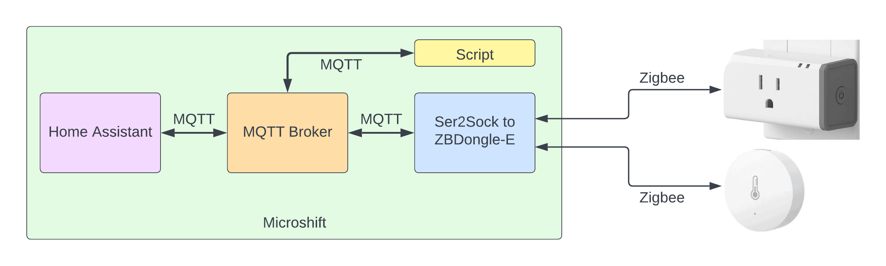
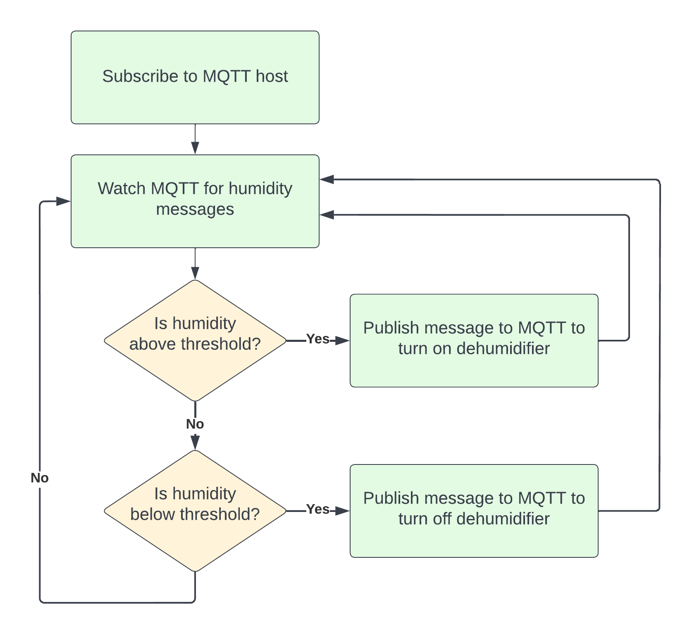

# **Monitoring Sensors and Taking Action**

I recently wrote a [blog](https://schmaustech.blogspot.com/2022/10/deploy-microshift-on-rhel8-with.html) around using [Microshift](https://microshift.io/) to run my [Zigbee2MQTT](https://www.zigbee2mqtt.io/) workload.  This blog described all the details on how to deploy Microshift and then deploy the components inside of Microshift to enable some home automation.  Of course with Zigbee2MQTT there is an intuitive web interface to interact with the smart devices.  However I wanted to take another approach that felt more ralistic when it comes to edge use cases.   I felt that in a industrial scenario there would be some code that would most likely subscribed and monitoring the MQTT queue.   An action would be performend when a certain event was observed and the action itself might publish something into the MQTT queue.   The rest of this blog will cover a simple scenario like I just described.

First we continue to use the same lab environment I used in my previous blog.  The only difference here in the diagram below is we have now added a smart power outlet and a temperature/humidity sensor that can both be controlled remotely via the Zigbee protocol like all my other devices. 

## The Script

With my lab in place I decided I wanted ot write something in Perl.  Some might think why use such an antiquated languange like Perl and part of that is because I am old school.  For my scenario I envisioned using the humidity sensor to detect when the humidity levels got too high.  The threshold would then trigger an action on the event to turn on/off a dehumidifier plugged into the smart outlet.  The basic process flow looks like the following diagram:

The script itself can take four different parameters:

 * --hostname: hostname or IP address of MQTT host (required)
 * --port: port for MQTT (optional but will default to 1883 if not provided)
 * --threshold: humidity value that determines when action should be taken
 * --help: prints the usage of script

The script itself is located [here](https://github.com/schmaustech/mqtt-sensors/blob/main/mqtt-humidity.pl)

When one runs the script without any flags the usage and an example will be displayed.

~~~bash
./mqtt-humidity2.pl 
Usage:
      --hostname,-h   Hostname or IP address of MQTT host
      --port,-p       Port for MQTT (defaults to default 1883)
      --threshold,-t  Threshold for humidity (defaults to 60)
      --help,-h       Print this help

    Example:

    mqtt-humidity.pl -ho 10.43.26.170 -p 1883 -t 65
~~~

## The Demonstration of Script

To demonstrate this script I went ahead and plugged in a light into my smart outlet which was in the off setting.   I launched the script in a terminal window.  Then I took the temperature/humidity sensor, cupped it in my hands and blew into my hands.   The moisture in my breath is enough to temporarily raise the value.  The script provides output so we can see the values changing and sure enough when I breathed into my hands with the sensor the value jumped to 81.37% which triggered the action event and turned on the light.  I then set the sensor back on my desk and over the course of 5 minutes the value slowly receded.  Once it dropped below the threshold value the light then turned back off.   The output of my script run is below:

~~~bash
$ perl mqtt-temp.pl -ho 10.43.26.170 -p 1883 -t 60
Temp C = 23.43 : Temp F = 74.174 : Humidity = 51.22
Temp C = 23.43 : Temp F = 74.174 : Humidity = 81.37 <-- Smart outlet turned on
Temp C = 23.43 : Temp F = 74.174 : Humidity = 84.37
Temp C = 23.43 : Temp F = 74.174 : Humidity = 82.37
Temp C = 23.43 : Temp F = 74.174 : Humidity = 80.28
Temp C = 23.43 : Temp F = 74.174 : Humidity = 78.79
Temp C = 23.63 : Temp F = 74.534 : Humidity = 78.79
Temp C = 23.63 : Temp F = 74.534 : Humidity = 73.21
Temp C = 23.63 : Temp F = 74.534 : Humidity = 74.34
Temp C = 23.63 : Temp F = 74.534 : Humidity = 72.91
Temp C = 23.63 : Temp F = 74.534 : Humidity = 71.65
Temp C = 23.63 : Temp F = 74.534 : Humidity = 70.55
Temp C = 23.63 : Temp F = 74.534 : Humidity = 69.15
Temp C = 23.63 : Temp F = 74.534 : Humidity = 67.93
Temp C = 23.63 : Temp F = 74.534 : Humidity = 66.57
Temp C = 23.63 : Temp F = 74.534 : Humidity = 64.87
Temp C = 23.63 : Temp F = 74.534 : Humidity = 63.28
Temp C = 23.63 : Temp F = 74.534 : Humidity = 62.08
Temp C = 23.63 : Temp F = 74.534 : Humidity = 60.71 
Temp C = 23.63 : Temp F = 74.534 : Humidity = 59.12 <-- Smart outlet turned off
Temp C = 23.63 : Temp F = 74.534 : Humidity = 57.72
Temp C = 23.63 : Temp F = 74.534 : Humidity = 56.7
Temp C = 23.63 : Temp F = 74.534 : Humidity = 55.6
Temp C = 23.63 : Temp F = 74.534 : Humidity = 54.23
Temp C = 23.63 : Temp F = 74.534 : Humidity = 53.21
Temp C = 23.63 : Temp F = 74.534 : Humidity = 52.14
Temp C = 23.63 : Temp F = 74.534 : Humidity = 51.05
Temp C = 23.63 : Temp F = 74.534 : Humidity = 50.04
Temp C = 23.22 : Temp F = 73.796 : Humidity = 50.04
Temp C = 23.22 : Temp F = 73.796 : Humidity = 50.04
^C
~~~

